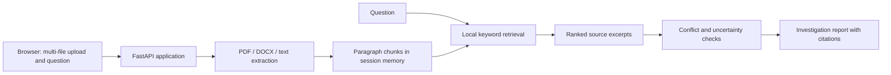

# DocuLens - ALG-AI-02 Intelligent Document Investigator

**Track:** AI/ML  
**Problem statement:** ALG-AI-02  
**Team/project:** DocuLens

DocuLens is a working, local-first document investigation demo. Upload several documents, ask a natural-language question, inspect ranked excerpts with file and page references, and review possible cross-document conflicts and explicit uncertainty notices. It directly demonstrates the ALG-AI-02 requirements for multiple document formats, extraction/indexing, natural-language question input, source references, conflict detection, and uncertainty handling.

## Run the demo

Requires Python 3.10 or newer. From this directory:

```bash
python -m venv .venv
# Windows PowerShell: .venv\Scripts\Activate.ps1
# macOS/Linux: source .venv/bin/activate
pip install -r requirements.txt
python app.py
```

Open <http://127.0.0.1:8000>. The API reference is at <http://127.0.0.1:8000/docs>; `/api/health` reports the track and PS ID. Upload PDF, DOCX, TXT, Markdown, or CSV files (12 MB per file), then enter a question. The document set lives in server memory and clears when the process restarts.

### Docker

```bash
docker build -t alg-ai-02 .
docker run --rm -p 8000:8000 alg-ai-02
```

## Core workflow

1. Upload one or multiple supported files.
2. Extract text; PDFs retain page numbers. Split text into searchable passages.
3. Rank passages with transparent local keyword overlap.
4. Return excerpts with filename, page when available, and a relative retrieval score.
5. Flag weak evidence and possible opposite-polarity passages from different files for human review.

### Architecture


```mermaid
flowchart LR
    U[Browser: multi-file upload and question] --> A[FastAPI application]
    A --> X[PDF / DOCX / text extraction]
    X --> C[Paragraph chunks in session memory]
    Q[Question] --> R[Local keyword retrieval]
    C --> R
    R --> E[Ranked source excerpts]
    E --> F[Conflict and uncertainty checks]
    F --> O[Investigation report with citations]
```

### API

- `GET /api/health` - liveness, track, and problem ID.
- `GET /api/documents` - current indexed files.
- `POST /api/documents` - multipart upload; repeat to add files.
- `DELETE /api/documents` - clear the in-memory document set.
- `POST /api/investigate` - JSON body `{"question":"..."}`.
- `GET /docs` - interactive OpenAPI documentation.

## Demo scope and limitations

This is an honest, inspectable baseline rather than a hosted LLM/RAG service. Retrieval uses keyword overlap, so paraphrases and semantic matches can be missed. The returned passages are evidence for a person to inspect; the application does **not** synthesize factual answers or claim medical/legal authority. Conflict detection is a heuristic polarity screen, not natural-language inference, and its flags require human review. Scanned/image-only PDFs need OCR before upload. Storage is in process memory, with no authentication, persistence, or multi-user isolation; deploy behind appropriate access controls and add tenant-scoped storage before real use. Uploads are limited to 12 MB each.

## Submission checklist

- [x] Multiple document upload and supported formats
- [x] Text extraction and indexing
- [x] Question entry and evidence retrieval
- [x] Source filename and PDF page references
- [x] Cross-document conflict warning heuristic
- [x] Explicit uncertainty and no-evidence responses
- [x] Working browser demo and OpenAPI docs
- [x] Architecture and run instructions
- [ ] Add your team names, repository URL, and deployed demo URL to the submission form
- [ ] Capture a short demo showing upload, source citations, a conflict case, and a no-evidence case

## Original project materials

The prior quantum-secure federated healthcare hallucination-detection engine, reports, notebooks, and presentation assets remain in this repository. The current submission app is deliberately scoped to ALG-AI-02; the earlier healthcare dashboard UI is not part of this launch path. The retained healthcare modules are not claimed as capabilities of DocuLens.

## Disclosure

Document extraction uses PyMuPDF and python-docx. The application uses no external AI API, hosted model, or external dataset. All uploaded files stay in process memory for the current server session.
